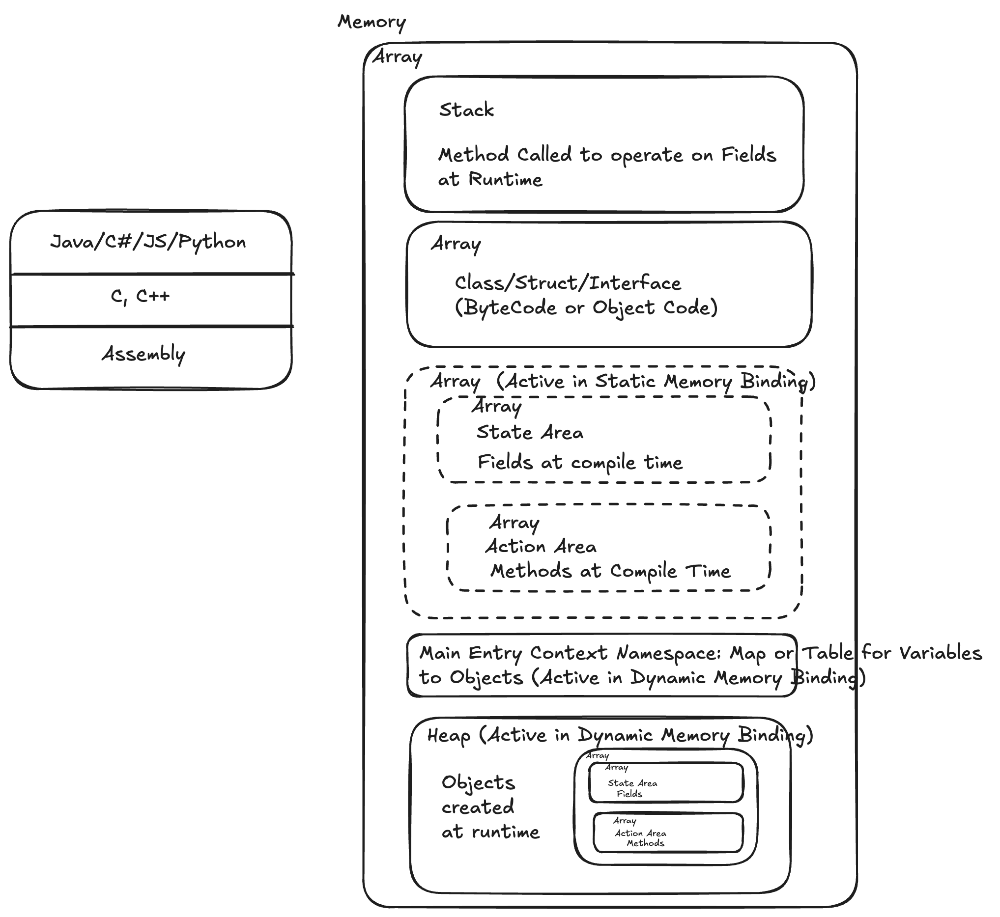

## Questions:
### 1. Is python a compilation based or interpretation based language?
* Python is interpreted, but under the hood it compiles to bytecode first, which the Python VM then interprets — so it's technically a hybrid model, similar to Java's JVM approach but without a separate compile step exposed to the user.
* CPython is the C-based reference implementation of Python that compiles code to bytecode and interprets it via the PVM — it's what you get when you download Python from python.org. It means the core interpreter that executes your Python code is itself written in C, and it's the 'official' implementation everyone treats as the standard — as opposed to alternative implementations written in other languages.
* Bytecode isn't a general-purpose language — it's CPython's own low-level instruction set (opcodes) that the interpreter's VM executes directly, similar conceptually to assembly but for a virtual machine instead of real hardware.
* Python does compile your script to bytecode every single time — it just doesn't always persist that bytecode to disk as a .pyc file. Compilation happens in-memory, and execution proceeds immediately from that in-memory bytecode.
    - Why no .pyc file appears for main.py: CPython's caching behavior differs based on how the code is loaded:
    - The entry-point script (e.g., python3 main.py) → compiled to bytecode in memory and run immediately. No .pyc is cached to disk, because there's no benefit — you're not going to "import" main.py again in the same run, so caching would just be wasted disk I/O.
    Imported modules (e.g., import utils) → these DO get cached as .pyc files inside __pycache__/. Why? Because imports can happen repeatedly (across multiple runs, or multiple times in large projects), so CPython caches the compiled bytecode to skip re-compilation next time — pure optimization.
    - Proof you can mention in an interview: If main.py does import utils, you'll see __pycache__/utils.cpython-3X.pyc appear — but never main.pyc.

### 2. What are some tools that python comes with for compilation, interpretration, run, lint, format etc.?
* Built-in / Standard Library (ships with Python):
python3 — the CPython interpreter itself; compiles + runs
py_compile — module to explicitly compile a .py to .pyc
compileall — compiles entire directories/packages to bytecode in bulk
dis — disassembler, shows bytecode instructions
ast — access the Abstract Syntax Tree before compilation
pdb — built-in interactive debugger
timeit — micro-benchmarking
unittest — built-in testing framework
venv — built-in virtual environment creator
pip — package installer (ships with Python 3.4+)

* Linting (not built-in, but industry standard — good to know):
pylint — deep static analysis, style + error checking
flake8 — combines pyflakes (errors) + pycodestyle (PEP8) + complexity checks
ruff — extremely fast (Rust-based), increasingly replacing flake8/pylint in modern projects

* Formatting:
black — opinionated, zero-config auto-formatter ("uncompromising")
autopep8 — auto-formats to PEP8
isort — sorts/organizes imports
ruff format — newer, fast alternative to black

* Type Checking (static):
mypy — most popular static type checker (uses type hints)
pyright — Microsoft's fast type checker (powers Pylance in VSCode)

* Alternative interpreters/runtimes (worth name-dropping):
PyPy — JIT-compiled, faster execution
Cython — compiles Python to C for performance

### 3. How packages, modules and import/export Work?
* Answer in new repo https://github.com/prashant-kiit/python-project

### 4. How Dynamic Typing works internally?
* Variables do not have types. There are just names that refers/points to the object. These object have types. 
An object being an instance of the class (like a template) has a type.
* Every value in Python (Value is nothing but what is being referenced by varibale) is Object in C (Cpython). 
That object has info like, ref counts, fields, methods, print, compare, hash, memry layout
```C
typedef struct {
    Py_ssize_t ob_refcnt;   // reference count (for garbage collection)
    PyTypeObject *ob_type;  // pointer to type info
} PyObject;
```
* In below code
```python
a = [1, 2, 3]
b = a
```
both a and b are keys in main dict that forms the global context for python compile time and runtime. Both here point to same object (same address) in the heap
* Type hints are purely for tools (mypy, IDEs) — CPython ignores them at compile or runtime entirely.

### 5. I want to understand what happens at compile time interally in python? How objects are created? How are Fields and Functions created? Where are they stored? Memory allocation is dynamic or static?
* Source (.py) 
   → Tokenizer (lexer) 
   → Parser → AST (Abstract Syntax Tree) 
   → Compiler → Bytecode (Code Object) 
   → PVM executes bytecode
* At stage of compilation, no object ie field or function or its class are created.
* Function creation — happens at RUNTIME, not compile time. This surprises people: def is an executable statement, not a declaration. When Python's interpreter executes a def line:
    - It runs the MAKE_FUNCTION opcode
    - This creates a function object at that moment — wrapping the pre-compiled code object + current global namespace reference + defaults + closures
    - Binds that function object to a name in the current namespace
* Object creation — how x = 5 actually happens
    - Bytecode has LOAD_CONST (for literals) or CALL_FUNCTION (for constructors)
    - At runtime, CPython allocates memory on the heap for a PyObject (via PyType_GenericAlloc → underlying pymalloc)
    - ob_type is set to point to the relevant type object (int, str, list, etc.)
    - ob_refcnt initialized to 1
    - Name (x) is bound in the current namespace dict to point to this object's memory address
* Memory Allocation — Dynamic, always. Python memory is 100% dynamically allocated at runtime — there's no static/stack allocation of user objects like in C. CPython's memory management layers:
    - pymalloc — CPython's private allocator for small objects (<512 bytes), sits on top of C's malloc. Optimized with memory pools/arenas to avoid excessive OS calls.
    - Reference counting — every PyObject has ob_refcnt. When it hits 0 → immediately deallocated.
    - Generational Garbage Collector — handles cyclic references (e.g., two objects referencing each other) that refcounting alone can't clean up. Runs periodically, checking 3 generations of objects.
* Stack vs Heap in Python (nuance for interviews):
    - The call stack holds frames (one per function call) — frames contain references to objects, not the objects themselves.
    - The actual objects always live on the heap, regardless of whether they're "local" variables or not. This is different from C/Java where primitives  can live on the stack.
### 6. What is the parent context (a dict with or without methods)?
A dict with With methods

### 7. What is the memory layout in python?

